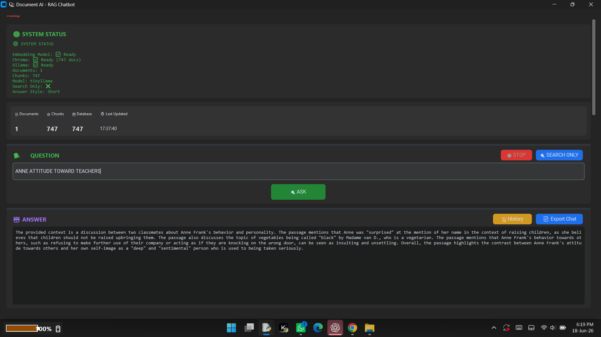

 
 # Screenshots

## Screenshot 1
.png)

## Screenshot 2
.png)

## Screenshot 3
.png)

## Screenshot 4
.png)

## Screenshot 5

 
 
 
 What is PLANEM?
PLANEM is a powerful, production-ready RAG (Retrieval-Augmented Generation) chatbot system that allows you to chat with your PDF documents using state-of-the-art AI technology. Built with a modern dark-themed GUI, it provides real-time indexing, intelligent retrieval, and evidence-based answers with confidence scoring. Everything runs locally on your machine - no API costs, no data leaving your computer, complete privacy guaranteed.

✨ Core Capabilities
📄 Smart Document Ingestion
Upload multiple PDF files and watch as PLANEM automatically extracts text, creates intelligent chunks, and builds a searchable vector database. The system shows you real-time progress with detailed status updates so you always know what's happening.

⚡ Real-time Indexing
Unlike traditional systems that make you wait, PLANEM shows you every step of the indexing process. You see page extraction progress, chunk creation counts, embedding generation status, and database storage progress with estimated time remaining.

🔍 Advanced Semantic Search
Using state-of-the-art Sentence Transformers with cosine similarity, PLANEM understands the meaning behind your questions - not just keywords. This means you get relevant answers even when your question uses different words than the document.

🤖 Local LLM Integration
PLANEM works with Ollama to run models locally. You can choose between TinyLlama for speed, Phi3 for balance, Gemma for quality, or Qwen2.5 for advanced capabilities. Zero cloud costs, zero privacy concerns.

📊 Intelligent Confidence Scoring
Every answer comes with a detailed confidence analysis. PLANEM evaluates retrieval quality, best match strength, answer coverage, and evidence quantity to give you a clear confidence score from 0 to 100 percent.

🎨 Modern Dark Theme Interface
The beautiful CustomTkinter interface features a professional dark theme with accent color support. Every section is clearly labeled and organized for intuitive navigation.

📱 Vertical Resizable Panels
Each section of the interface has a drag handle at the top. Simply click and drag to resize any panel vertically. The interface adapts to your preferred layout without squeezing content.

💾 Complete Chat History
Every conversation is automatically saved to a SQLite database. You can revisit previous chats, export your entire history to a text file, or clear history when needed.

🔒 Strict Grounding System
PLANEM is designed to prevent hallucinations. It only answers from the provided documents and clearly states when information cannot be found. No made-up facts, no outside knowledge leakage.

🛠️ Technology Stack
PLANEM is built on a robust stack of proven technologies. The vector database is ChromaDB, which provides fast and scalable similarity search. For embeddings, we use the all-MiniLM-L6-v2 model from Sentence Transformers - it's fast, lightweight, and delivers excellent semantic understanding. The GUI is powered by CustomTkinter, giving us a modern, dark-themed interface that works on all platforms. PDF processing uses pdfplumber for advanced extraction with PyPDF2 as a fallback. The LLM integration is handled through Ollama, supporting multiple models including TinyLlama, Phi3, Gemma, and Qwen2.5. Chat history is stored in SQLite for reliable, lightweight database operations.

📦 Installation Guide
Prerequisites
Before installing PLANEM, ensure you have Python 3.11 or higher installed on your system. You'll also need Ollama installed and running, as it handles the local LLM inference. Git is optional but recommended for cloning the repository.

Step 1: Get the Code
Clone the repository using Git or download it directly from GitHub.

bash
git clone https://github.com/yourusername/planem.git
cd planem
Step 2: Install Dependencies
Install all required Python packages using pip. The main dependencies include customtkinter for the GUI, chromadb for vector storage, sentence-transformers for embeddings, pdfplumber for PDF processing, and ollama for LLM integration.

bash
pip install -r requirements.txt
If you prefer to install manually:

bash
pip install customtkinter chromadb sentence-transformers pdfplumber PyPDF2 ollama
Step 3: Set Up Ollama
Ollama is required for running local LLM models. Download and install Ollama from the official website if you haven't already. Then pull your preferred model.

bash
# Install Ollama from https://ollama.ai/download
# Then pull your model of choice
ollama pull tinyllama
# OR
ollama pull phi3
# OR
ollama pull gemma
Step 4: Directory Structure
PLANEM expects a specific directory structure. The models folder contains the embedding model files. The test_data folder is where you place your PDFs. The chroma_db folder holds the vector database. Settings are stored in settings.json and chat history in chat_history.db.

text
📁 PLANEM/
   ├── 📁 models/
   │   └── 📁 all-MiniLM-L6-v2/
   ├── 📁 test_data/
   ├── 📁 chroma_db/
   ├── 📄 settings.json
   ├── 📄 chat_history.db
   └── 📄 full_system.py
🚀 Quick Start Guide
Launch the Application
Start PLANEM by running the main Python file. The GUI will open immediately while models load in the background.

bash
python full_system.py
First-Time Setup
When you launch PLANEM for the first time, it will start loading the embedding model and connecting to ChromaDB. You'll see status updates in the System Status panel. Wait for the "All systems ready" message before proceeding. If this is your first run, the system will automatically create the necessary database and configuration files.

Index Your Documents
To start using PLANEM, you need to index your PDF documents. Navigate to the Document Ingestion section and click the Add PDF button to select your files. Once uploaded, click Update Indexes to start the indexing process. Watch the live progress in the Processing Log panel - you'll see page extraction, chunk creation, embedding generation, and database storage progress with estimated time remaining.

Ask Questions
Once your documents are indexed, you can start asking questions. Type your question in the Question field and press Enter or click the Ask button. PLANEM will search the indexed documents, find the most relevant passages, and generate an evidence-based answer. Every answer comes with a confidence score and detailed source verification.

🎮 Using PLANEM
Understanding the Interface
The PLANEM interface is organized into several clear sections. At the top, you'll find the System Status panel showing real-time health of all components. Below that are Status Cards displaying document count, chunk count, database size, and last update time. The Question section is where you type your queries and control generation. The Answer section displays AI responses. The Confidence Bar shows the confidence score with color coding. The Source Verification section shows evidence with page numbers. Settings allow you to configure chunk size, overlap, top-k retrieval, temperature, answer style, theme, and accent color. The Document Manager shows all your PDFs with indexing status. Document Ingestion handles uploads and indexing. The Processing Log shows live progress, System Events logs all actions, and the Error Console tracks issues.

Working with Settings
PLANEM offers extensive customization. Chunk Size controls how many characters go into each text chunk - larger chunks capture more context but may include irrelevant information. Chunk Overlap ensures continuity between chunks. Top-K determines how many chunks are retrieved from the database. Max Context Chunks controls how many chunks are sent to the LLM. Similarity Threshold filters out low-quality matches - higher values mean more relevant but fewer results. Temperature controls creativity - lower values produce more focused answers. Answer Style lets you choose between Short, Medium, or Detailed responses. Max Sentences caps the answer length. Theme switches between Dark, Light, and System appearance. Accent Color changes the application's primary color.

Using Search Only Mode
Search Only Mode is a powerful feature that skips the LLM entirely. When enabled, PLANEM shows you the retrieved chunks directly without generating a synthesized answer. This is extremely fast - about 10 times faster than full generation. It's perfect for quickly finding specific information or verifying what's in your documents. Toggle it on and off with a single click.

Managing Documents
The Document Manager shows all PDFs in your test_data folder. Indexed documents display with a green checkmark and INDEXED status. New documents show with a red X and NOT INDEXED status. You can delete documents directly from the interface - this removes the file from your system and removes it from the vector database automatically.

Exporting and History
PLANEM keeps a complete history of all conversations. You can view recent chats in a popup window or export your entire chat history to a text file. Each entry includes the timestamp, question, answer, sources, confidence score, and model used. This is invaluable for tracking research progress or reviewing past interactions.

🧠 How PLANEM Works
Indexing Pipeline
When you index documents, PLANEM follows a sophisticated pipeline. First, it extracts text from each PDF page using pdfplumber, with PyPDF2 as a fallback. The extracted text is split into chunks with intelligent overlap and duplicate removal. Each line is tied to its specific page number so we always know where information came from. The system generates embeddings using Sentence Transformers and stores them in ChromaDB with cosine similarity space. This creates a searchable vector database of all your document content.

Retrieval Process
When you ask a question, PLANEM generates an embedding for your question and performs a cosine similarity search against the indexed chunks. It retrieves the top-K most similar chunks and filters them based on the similarity threshold. Only chunks that pass the threshold are considered for the answer. This ensures high-quality, relevant information is used.

Answer Generation
For each question, PLANEM assembles the retrieved chunks into a context with page citations. It uses a carefully crafted prompt that instructs the LLM to answer only from the provided context. The prompt enforces strict grounding - the LLM cannot use outside knowledge and must clearly state when information cannot be found. The LLM generates a response, and PLANEM captures the result along with page citations.

Confidence Scoring
PLANEM's confidence scoring is one of its most sophisticated features. Retrieval Score measures the average similarity of retrieved chunks. Best Chunk Score looks at the highest similarity among all chunks. Coverage Score evaluates how much of the answer is covered by the source text. Evidence Score considers how many relevant chunks were retrieved. These four scores are combined with different weights to produce a final confidence percentage. Answers scoring 80% or higher show as Strong, 60-79% as Moderate, and below 60% as Weak.

🔧 Troubleshooting
Common Issues and Solutions
If you see "No documents indexed yet," simply upload PDFs and click Update Indexes. If models are not loading, check that Ollama is running by typing "ollama list" in your terminal. If you get a ChromaDB error, delete the chroma_db folder and rebuild the database. If performance is slow, try reducing Top-K or Max Context Chunks in settings. If you're getting low confidence scores, improve your document quality or lower the similarity threshold. If the GUI doesn't appear, check your Python version and reinstall the dependencies.

Debug Commands
You can check Ollama status with "ollama list". Test the embedding model by importing SentenceTransformer and loading all-MiniLM-L6-v2. Check ChromaDB by importing chromadb and listing collections. To reset everything, delete the chroma_db folder, chat_history.db file, and settings.json file - the system will recreate them on next launch.

System Requirements
For minimum performance, you need a 4-core CPU, 8GB of RAM, and 10GB of storage. For recommended performance, use an 8-core CPU, 16GB of RAM, and 50GB of storage. Python 3.11 is the minimum version, with 3.12 recommended. Use the latest version of Ollama for best results.

📝 License
PLANEM is released under the MIT License, which means it's free for both commercial and personal use. You can modify, distribute, and use the software without restrictions. The license requires only that you include the original copyright notice and disclaimers. No attribution is required for derivative works.

Contributing
We welcome contributions to PLANEM. Fork the repository, create your feature branch, commit your changes, push to the branch, and open a Pull Request. All contributions are reviewed and appreciated.

🌟 Why PLANEM?
PLANEM stands out from other RAG systems for several reasons. It runs completely offline with zero API costs, ensuring your data never leaves your machine. The modern dark-themed GUI is intuitive and professional. Real-time progress tracking keeps you informed during indexing. The comprehensive confidence scoring system helps you trust the answers. Strict grounding prevents hallucinations. Multiple LLM models give you flexibility. Chat history and export features support research workflows. Vertical resizing lets you customize the interface. And everything is open source and free.

📞 Support
For issues, visit the GitHub Issues page. For discussions and questions, use GitHub Discussions. For urgent matters, reach out through the repository maintainers.

🙏 Acknowledgments
PLANEM is built on the shoulders of giants. Thanks to Sentence Transformers for the embedding models, ChromaDB for vector storage, Ollama for local LLM inference, CustomTkinter for the modern GUI, pdfplumber for PDF extraction, and the entire open-source community that makes projects like this possible.

📊 Quick Reference
Keyboard Shortcuts
Enter: Submit question (when in Question field)

Escape: Cancel current operation

File Locations
PDFs: test_data folder

Database: chroma_db folder

Settings: settings.json

History: chat_history.db

Models: models folder

Ports Used
Ollama: 11434 (default)

Default Settings
Chunk Size: 800

Chunk Overlap: 150

Top-K: 10

Max Context: 3

Similarity Threshold: 0.50

Temperature: 0.2

Model: TinyLlama

Answer Style: Short

Max Sentences: 3

Theme: Dark

Accent Color: Blue

Built with ❤️ for the open-source community

PLANEM - Your intelligent document assistant that flies through information
